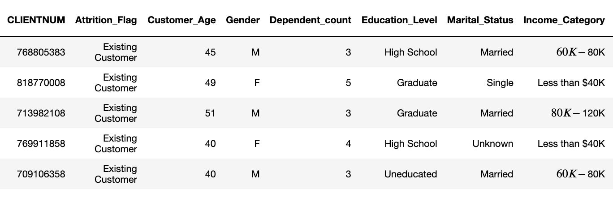
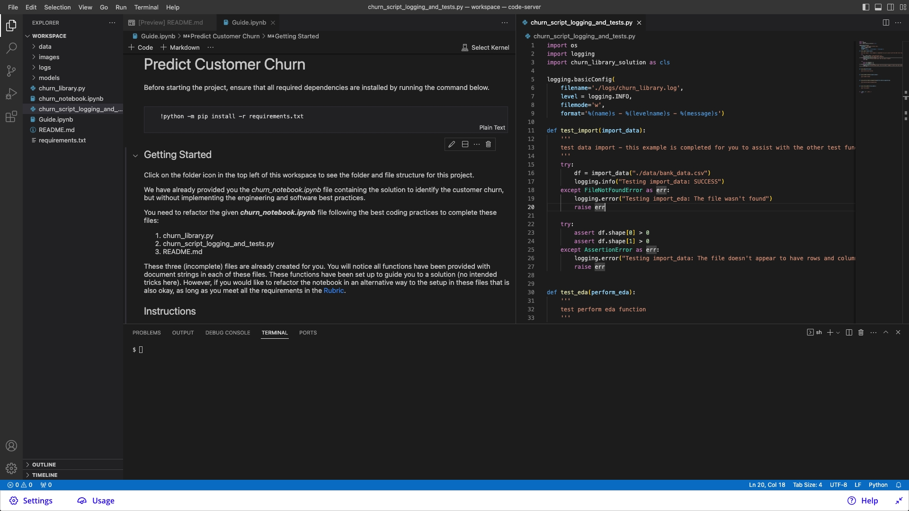

# Project Introduction
In this project, you will implement your learnings to identify credit card customers who are most likely to churn. The completed project will include a Python package for a machine learning project that follows coding (PEP8) and engineering best practices for implementing software (modular, documented, and tested). The package can also be run interactively or from the command-line interface (CLI).

This project will give you practice using your skills for testing and logging and using the best coding practices from this lesson. It will also introduce you to a problem data scientists across companies always face. How do we identify (and later intervene with) customers likely to churn?

If you want to download the data and work locally with the data, start the Workspace and download the data from the data folder. This ensures all students have access to the dataset. Below, you have a sample of the dataset:



Note: This project provides all students with a Workspace that includes all the requirements needed to develop and run the project. If you prefer to run it locally, you can download the project files from the project repository(opens in a new tab) and use your own local environment to develop and run the project.

Project Workspace Example with all files in the left panel and a screen with one notebook and three files to be developed by the students.


Project Workspace





# Objective
This is a project to implement best coding practices. You will not need to code for this project entirely from scratch.

We have already provided you the churn_notebook.ipynb file containing the solution to identify credit card customers that are most likely to churn, but without implementing the engineering and software best practices.

You will need to refactor the given churn_notebook.ipynb file following the best coding practices to generate these files:

- churn_library.py
- churn_script_logging_and_tests.py
- README.md

## Starter Files
Here is the file structure available to you in the workspace next.

.
├── Guide.ipynb          # Given: Getting started and troubleshooting tips
├── churn_notebook.ipynb # Given: Contains the code to be refactored
├── churn_library.py     # ToDo: Define the functions
├── churn_script_logging_and_tests.py # ToDo: Finish tests and logs
├── README.md            # ToDo: Provides project overview, and instructions to use the code
├── data                 # Read this data
│   └── bank_data.csv
├── images               # Store EDA results 
│   ├── eda
│   └── results
├── logs				 # Store logs
└── models               # Store models

> The Guide.ipynb and churn_notebook.ipynb will be your starting point for the project.

## High-Level Instructions
These are the three files you will need to complete after refactoring the churn_notebook.ipynb file:

**1. churn_library.py**

The churn_library.py is a library of functions to find customers who are likely to churn. You may be able to complete this project by completing each of these functions, but you also have the flexibility to change or add functions to meet the rubric criteria.


The document strings have already been created for all the functions in the churn_library.py to assist with one potential solution. In addition, for a better understanding of the function call, see the Sequence diagram on the next page.

After you have defined all functions in the churn_library.py, you may choose to add an `if __name__ == "__main__"` block that allows you to run the code below and understand the results for each of the functions and refactored code associated with the original notebook.

```
ipython churn_library.py
```

**2. churn_script_logging_and_tests.py**

This file should:

- Contain unit tests for the churn_library.py functions. You have to write test for each input function. Use the basic assert statements that test functions work properly. The goal of test functions is to checking the returned items aren't empty or folders where results should land have results after the function has been run.

- Log any errors and INFO messages. You should log the info messages and errors in a .log file, so it can be viewed post the run of the script. The log messages should easily be understood and traceable.

Also, ensure that testing and logging can be completed on the command line, meaning, running the below code in the terminal should test each of the functions and provide any errors to a file stored in the /logs folder.

```
ipython churn_script_logging_and_tests.py
```

> [!NOTE] Testing framework: As long as you fulfil all the rubric criteria, the choice of testing framework rests with the student. For instance, you can use pytest(opens in a new tab) for writing functional tests.

**3. README.md**
This file will provide an overview of the project, the instructions to use the code, for example, it explains how to test and log the result of each function. For instance, you can have the following detailed sections in the README.md file:

- Project description
- Files and data description
- Running the files

## Code Quality Considerations

- **Style Guide** - Format your refactored code using PEP 8 – [Style Guide](https://peps.python.org/pep-0008/). Running the command below can assist with formatting. To assist with meeting pep 8 guidelines, use autopep8 via the command line commands below:

```
autopep8 --in-place --aggressive --aggressive churn_script_logging_and_tests.py
autopep8 --in-place --aggressive --aggressive churn_library.py
```

- Style Checking and Error Spotting - Use [Pylint](https://pypi.org/project/pylint/) for the code analysis looking for programming errors, and scope for further refactoring. You should check the pylint score using the command below.

```
pylint churn_library.py
pylint churn_script_logging_and_tests.py
```

You should make sure you don't have any errors, and that your code is scoring as high as you can get it! Shoot for a pylint score exceeding 7 for both Python files.

- Docstring - All functions and files should have document strings that correctly identifies the inputs, outputs, and purpose of the function. All files have a document string that identifies the purpose of the file, the author, and the date the file was created.

# Final Expectation
The project requires completed versions of these files:

- churn_library.py
- churn_script_logging_and_tests.py
- README.md

# Sequence diagram

The code in churn_library.py should complete data science solution process including:

* EDA
* Feature Engineering (including encoding of categorical variables)
* Model Training
* Prediction
* Model Evaluation

Help - Document Strings
Below is the docstring for each function present in the churn_library.py file.

import_data()
```py
    import_data(pth)
        returns dataframe for the csv found at pth
        
        input:
                pth: a path to the csv
        output:
                df: pandas dataframe
```
perform_eda()

```py
    perform_eda(df)
        perform eda on df and save figures to images folder
        input:
                df: pandas dataframe
        
        output:
                None
```


perform_feature_engineering()
```py
    perform_feature_engineering(df, response)
        input:
                  df: pandas dataframe
                  response: string of response name
        
        output:
                  X_train: X training data
                  X_test: X testing data
                  y_train: y training data
                  y_test: y testing data
```

encoder_helper()
Use one-hot encoding or mean of the response to fill in categorical columns.
```py
    encoder_helper(df, category_lst, response)
        helper function to turn each categorical column into a new column with
        propotion of churn for each category - associated with cell 15 from the notebook
        
        input:
                df: pandas dataframe
                category_lst: list of columns that contain categorical features
                response: string of response name
        
        output:
                df: pandas dataframe with new columns for
```

train_models()
```py
    train_models(X_train, X_test, y_train, y_test)
        train, store model results: images + scores, and store models
        input:
                  X_train: X training data
                  X_test: X testing data
                  y_train: y training data
                  y_test: y testing data
        output:

                  None
```


classification_report_image()

```py
    classification_report_image(y_train, y_test, y_train_preds_lr, y_train_preds_rf, y_test_preds_lr, y_test_preds_rf)
        produces classification report for training and testing results and stores report as image
        in images folder
        input:
                y_train: training response values
                y_test:  test response values
                y_train_preds_lr: training predictions from logistic regression
                y_train_preds_rf: training predictions from random forest
                y_test_preds_lr: test predictions from logistic regression
                y_test_preds_rf: test predictions from random forest
        
        output:
                 None
```
feature_importance_plot()

```py
    feature_importance_plot(model, X_data, output_pth)
        creates and stores the feature importances in pth
        input:
                model: model object containing feature_importances_
                X_data: pandas dataframe of X values
                output_pth: path to store the figure
        
        output:
                 None
```